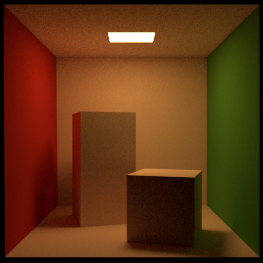
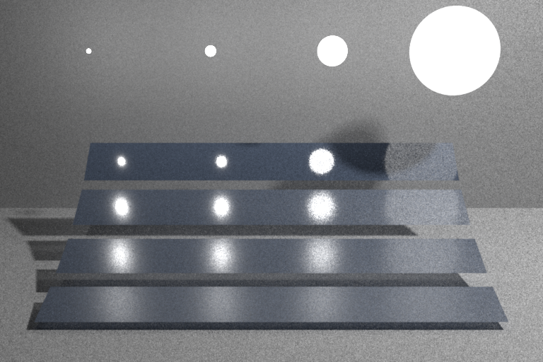

# Rainbow-Renderer

Rainbow-renderer is a simple physical based renderer.

## Build

- Clone or download the repository and submodules.
```
git clone https://github.com/LinkClinton/rainbow-renderer.git

git submodule update --init --recursive
```
- Using `vcpkg` to install third-parties.
- Open `.sln` with Visual Studio 2019 and build it.

## Requirement

- C++ 17

## Scene

Now only support part of `mitsuba` scene format. See more in [meta-scene](https://github.com/LinkClinton/meta-scene). It is a library to load different scene format.

## Gallery

[A Mitsuba conversion of the classic Cornell Box scene.](http://mitsuba-renderer.org/download.html)



[Multiple importance sampling test — based on a scene by Eric Veach](http://mitsuba-renderer.org/download.html)

